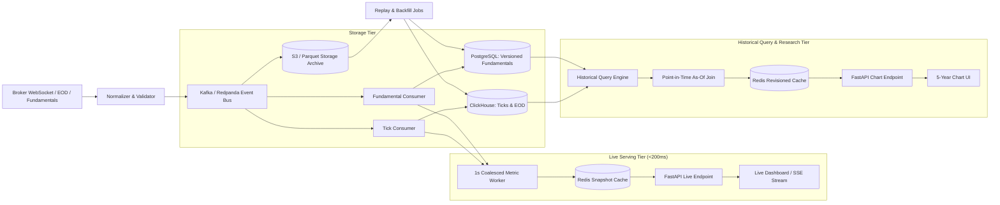

# Multi-Frequency Financial Data Platform

## Short Answer & Core Value Proposition

This design solves the **temporal join & look-ahead bias problem** for 5,000+ NSE/BSE symbols across tick, daily (EOD), quarterly, and annual frequencies.

It separates **live low-latency serving** from **point-in-time correct historical research**:
- **Live Use Case**: Serves latest price, valid EPS snapshot, live P/E, yield, and momentum in `<200ms` without waiting for historical joins.
- **Historical Use Case**: Joins historical price with the exact EPS available to the market at that timestamp (`available_at <= market_timestamp`), avoiding look-ahead bias (e.g. using today's EPS for a 2022 price point).

---

## Architecture Diagram



---

## Q1: Storage Architecture & Point-in-Time Correctness

### Proposed Storage Stack

| Data Frequency | Proposed Storage Technology | Table Schema & Ordering Strategy | Key Purpose & Assessment |
| :--- | :--- | :--- | :--- |
| **Tick & EOD Prices** | **ClickHouse** | `PARTITION BY trading_date`<br>`ORDER BY (symbol, event_time)` | High-throughput columnar store for fast time-series analytical scans & aggregations. |
| **Fundamentals** | **PostgreSQL** | `versioned_fundamentals`<br>`(symbol, period_end, available_at, version)` | Relational metadata with ACID guarantees, constraints, and point-in-time versioning. |
| **Latest Live Snapshot** | **Redis** | `HSET live:metrics:{symbol}` | Low-latency serving key-value store for `<200ms` API responses. |
| **Raw Archive & Replay** | **S3-compatible Storage (Parquet)** | `s3://archive/{dataset}/{year}/{month}/` | Immutable long-term retention & offline backfill replay with ZSTD compression. |
| **Event Stream** | **Kafka / Redpanda** | Partition Key: `exchange:symbol` | Scalable event bus ensuring per-symbol sequential ordering. |

---

### Data Retention & Archival Strategy

| Data Tier / Age | Storage Location | Resolution & Formatting | Primary Use Case |
| :--- | :--- | :--- | :--- |
| **0 – 90 Days** | ClickHouse (Hot analytical tier) | Raw Ticks & EOD prices | Microstructure research, slippage analysis, live metrics. |
| **90 Days – 2 Years** | Compressed Parquet in Object Storage | Raw Ticks (ZSTD compressed) | Tick-level volatility studies & order-book reconstruction. |
| **Multiple Years** | ClickHouse (Materialized Views) | 1-minute & 5-minute bars | Multi-year intraday charting & factor calculations. |
| **Full History (5+ Years)** | ClickHouse & Parquet Archive | Daily OHLCV & Corporate-Adjusted Prices | 5-Year P/E historical charting & backtesting. |

---

### Point-in-Time Correctness & Versioning Semantics

To eliminate look-ahead bias, fundamental updates introduce explicit version semantics:

- **`released_at`**: Exact timestamp when company publicly publishes earnings.
- **`available_at`**: Timestamp when data is ingested & usable for trading decision (e.g. after-market releases become available for next session).
- **`supersedes_version`**: Explicit pointer to the earlier version replaced by restatement/correction.
- **`is_restatement`**: Boolean flag marking corrections without altering historically knowable data.

```sql
-- Conceptual Point-in-Time Historical Join Query
SELECT p.symbol, p.date, p.close_price, f.eps_ttm,
       (p.close_price / NULLIF(f.eps_ttm, 0)) AS pe_ratio
FROM eod_prices p
ASOF LEFT JOIN versioned_fundamentals f
  ON p.symbol = f.symbol
 AND f.available_at <= p.market_timestamp
ORDER BY p.date ASC;
```

---

## Q2: Compute Engine Strategy (Derived Metrics)

### Computation Matrix by Metric Type

| Metric / Computation | Recommended Approach | Coalescing / Trigger Details |
| :--- | :--- | :--- |
| **Current Price** | On-write / On-tick arrival | Update latest Redis price state immediately. |
| **Live P/E Ratio** | Event-driven (Coalesced 1 second) | Debounced per symbol over 1-second window to prevent tick noise work. |
| **Live Dividend Yield** | Event-driven | Triggered on price change or fundamental dividend version update. |
| **Historical P/E** | On-read (Cached) | Computed via `ASOF JOIN` between ClickHouse EOD and PostgreSQL fundamentals. |
| **Rolling Momentum** | Scheduled batch / Incremental | Materialized hourly/daily for fast API lookups. |
| **Restatement Backfills** | Scheduled versioned batch | Recomputes derived historical metric partitions without rewriting past `available_at` states. |

---

### Live P/E Definition & Edge Case Rules

- **Metric Standard**: `pe_ttm_adjusted_consolidated = latest_price / latest_available_eps_ttm`
- **Zero EPS (`EPS = 0`)**: P/E is **Undefined** (`NULL`).
- **Negative EPS (`EPS < 0`)**: Returns **`NM`** ("Not Meaningful") instead of misleading negative multiples.
- **Missing Data**: Returns `NULL` with reason code `MISSING_FUNDAMENTALS`.
- **Targeted Invalidation**: When RELIANCE issues Q3 earnings, invalidate **only** `live:metrics:RELIANCE` key to avoid fundamental invalidation storms across unrelated symbols.

---

## Q3: APIs & Low-Latency Serving (<200ms)

### Serving Patterns & Caching Architecture

| Request Pattern | Endpoint & Method | Serving Path & Caching Strategy | Target Latency |
| :--- | :--- | :--- | :--- |
| **Pattern A: Live Dashboard** | `GET /v1/stocks/{symbol}/metrics`<br>`SSE /v1/stocks/{symbol}/stream` | Direct read from **Redis Hash**. Fallback to secondary materialized snapshot with freshness timestamp. | `<50ms` (Target `<200ms`) |
| **Pattern B: Historical Chart** | `GET /v1/stocks/{symbol}/chart/pe`<br>`?start=2021-10-01&end=2026-10-01` | Query service executes ClickHouse + PostgreSQL `ASOF` join. Cached with revision key: `pe:v3:{symbol}:{revision}:{range}` | `<150ms` (Cached) |

---

## Q4: Operational Awareness & Data Integrity

- **Idempotency & Deduplication**: Kafka event consumer uses `(exchange, symbol, event_id)` deduplication keys to prevent duplicate tick processing.
- **Clock Skew & Session Alignment**: Converts all timestamps to **UTC**, retaining exchange market-session metadata (NSE IST timezone). After-market releases (e.g. 7 PM IST) map to the next trading session opening time.
- **Dead-Letter Queue (DLQ)**: Malformed broker socket ticks or irregular filings divert to DLQ for manual audit without blocking streaming consumers.
- **Reconciliation Engine**: Daily EOD reconciliation script compares broker exchange trade totals against stored ClickHouse row counts.
